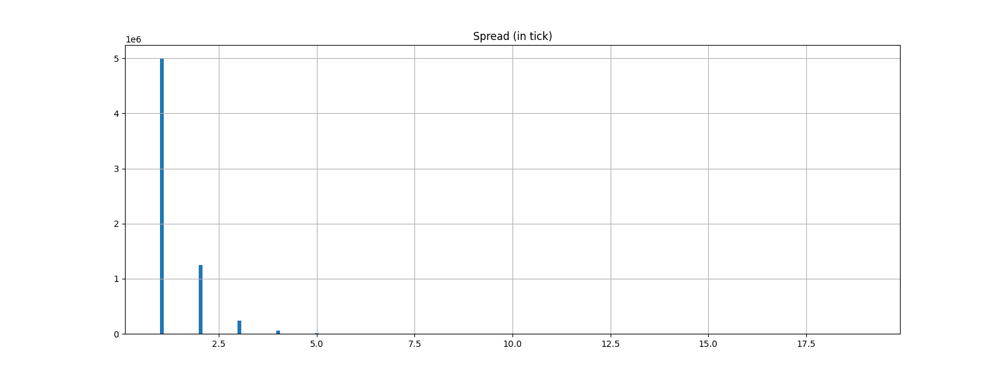
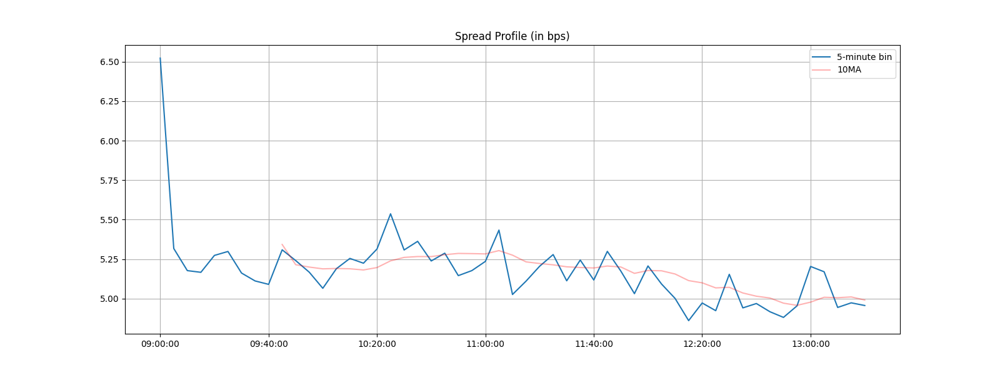

# Abstract

Order Placement Strategy plays an important role in today's electronic trading. It helps traders to reduce inventory risk, deal with slippage and execution risk. In this paper, we conduct in-depth analysis on the Taiwan stock and ETF market to explore an optimal order placement strategy under the situation when there are more than one ticks between the bid and ask. By analyzing the spread distribution, effect of order replacement, as well as the characteristics and influence of flickering quotes, we demonstrated that ....

# Stage 1 - Data Exploration

# Stage 2 - Order Replacement Strategy 

# Stage 3 - Optimization Results

# Stage 4 - Characteristics and Influence of Flickering Quotes

# Stage 5 - Order Replacement Strategy with Flickering Quotes

Knowing that flickering quotes may actually have an impact on the results of order placement simulations we have done at stage 2, it can actually serve as a signal indicating the aggressiveness and urgency of placing orders from other market participants. For example, when we are sending bid orders, a frequently observed far-touch (ask side) flickering quote may indicate that some participants are urgently selling, and thus market tends go down and trade into our flavor. In such cases, waiting passively for a fill may be more optimal than actively replacing the order with an improved price. 

We will now re-run the above simulations (stock_code = 0050, side = bid, threshold of flash order = 300ms), taking observed flickering quote into account. The following order handling logic are added:

- If # near-touch flickering quotes > $n$ are observed within the time horizon of current order simulation, we cancel the order immediately, believing the a near-touch flickering quote

- If # far-touch flickering quotes > $n$ are observed and we haven't yet replaced our order (i.e., current duration < $t_m$), we don't replace our order and stay at the current price til $t_s$ (Essentially we set $t_m = t_s$ in the current simulation).

For simplicity, we have set $n = 1$ in the simulations. We expect that mean scores will improve, number of TAKE cases will decrease as we cancel orders that may possibly trade against our flavor, and number of INIT cases will increase as we wait longer for orders that may possibly trade into our flavor. The heatmap of the simulation results ($t_s = 1,...,20; t_m = 1,...,20$) are shown below:

{#id .class width=99% height=99%}

In fact, we didn't observe a significant improvement in scores over the set of simulation parameter, and for some of the simulations the score even worsened. For instance, score of set $t_m = 10, t_s = 20$ is -2.08 without consideration of flickering quotes, but -2.11 with the consideration. To verify and explain the observation, we may do a cases distribution breakdown:

{#id .class width=70% height=70%}

We can observe that:

- ~2000 cases are cancelled due to observation of near-touch flickering quotes, so actual traded cases (51225 - 2085 = 49140) dropped by ~800
- REP cases dropped by ~1350 (~3%)
- INIT cases dropped by ~300 but INITFFO (INIT cases with observed far-touch flicker quotes) has ~250 cases
- TAKE cases increased by ~800

We can interpret the amendment on strategy as taking risk on 2 aspects based on our observation on flickering quotes occurrence:

- By cancelling orders with near-touch flickering quotes, we bet on that scores will improve with decreasing number of TAKE cases (in the cost of that the order may turn out to be an INIT / REP case), and;
- By choosing to wait instead of replacing our order, we bet on that scores will improve with increasing number of INIT / INITFFO cases (in the cost of that the order may turn out to be a TAKE case)

Although we observed some INITFFO cases, overall cases of INITFFO + INIT didn't show a significant improvement. It is concluded from the simulations that the improvement in PnL, due to more INIT / INITFFO / REP cases, is not sufficient to compensate the drop in PnL, due to more TAKE cases. A potential improvement on the signalling of flickering quote would be adjusting parameter $n$. For example, only cancel the order / choose to wait when more number of near- / far-touch flickering quotes are observed.

# Conclusion

# Reference

