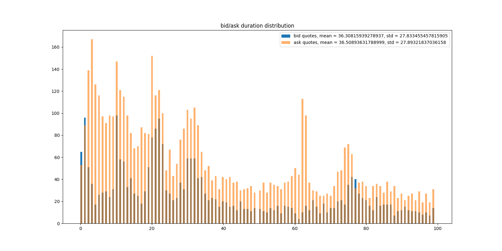

# Abstract

Order Placement Strategy plays an important role in today's electronic trading. It helps traders to reduce inventory risk, deal with slippage and execution risk. In this paper, we conduct in-depth analysis on the Taiwan stock and ETF market to explore an optimal order placement strategy under the situation when there are more than one ticks between the bid and ask. By analyzing the spread distribution, effect of order replacement, as well as the characteristics and influence of flickering quotes, we demonstrated that an order replacement strategy we proposed can help to reduce the price risk as well as inventory risk. Moreover, even though the flickering quotes in Taiwan market can serve as a prediction signal, the effect is not strong enough to improve our order replacement strategy at least in the Taiwan market.  

# Stage 1 - Data Exploration

At the first stage, we explore the market data to understand the characteristics of the bid-ask spread. Given the fact that stock 2330 and ETF 0050 have a similar result, we will present the result of 0050 in the rest of the report. 

{#id .class width=60% height=60%}

As shown in the graph, the bid-ask spreads of ETF 0050 are around 75% in 1- tick, 20% in 2-tick and other 5% in more than 3-tick. It may be because of the inefficiency of ETF so that bid-ask spread has more chance to stay more than 2 ticks. 

{#id .class width=60% height=60%}

From the spread profile of 0050, we can observe that in the first 5 minutes after market open, the spread tends to be statistically larger than the ones in other period of a day. We believe it is due to the active trading activity at market open since many traders are using some ETF tracking or arbitrage strategies. Since there are more pricing and flows during the first minutes of market open, spread may occurs in this period and there are more chances for us to utilize it with our proposed order placement strategy.

# Stage 2 - Order Replacement Strategy 

Under the condition when there are more the one tick in the bid-ask spread, we are trying to explore how to utilize the inefficiency in the market to help us better execute our orders. Initially we propose a strategy with replacement as follows:(take bid side as an example)

- When observing a two-ticks scenario, we first put our order at price bid 1 which we denote as $b_1$.

- Meanwhile, we define $t_\star$ as the maximum time we want to wait until the order gets hit, otherwise we cross the spread to buy at the ask price 1 which denoted as $a_1$. Besides, we define $t_m$ as the time when we decide to replace our bid order to the mid quote $b_\star$ expecting the $a_1$ will comes down so that we can benefit our pnl from the price movement. 

Following this strategy, we can have three different results:

- If the price comes down $b_1$ before $t_m$, our order got filled at at $b_1$ before $t_m$
- If our order is not traded before $t_m$, we replaced order at $b_1$ with $b_\star$ at $t_m$, if the $a_1$ move down to $b_\star$ or a large market trade happens at $t_m$ < t < $t_{start}$, we got filled at $b_\star$ 
- After Replacing the order at $b_1$ with $b_\star$ at $t_m$, we waited til $t_\star$ but no people hit our price, we then cross the spread, fill at $a_1$

{#id .class width=49% height=49%}

In this case, we enter the trade at 146.5 when the ask is 146.6 and bid sits at 146.5. After 5000ms($t_m$), our order at $b_1$ has not been executed, we then lift it to 146.55 which is one tick higher than the original price. Fortunately, the ask 1 comes down and our new bid order gets executed within $t_\star$

{#id .class width=49% height=49%}

In this example, we enter the trade at 146 when the ask is 146.15 and bid sits at 146. After 5000ms($t_m$), our order at $b_1$ has not been executed, we then lift it to 146.05 which is one tick higher than the original price. However, we didn't get filled after $t_m$ so we cross the spread and take the price at $a_1$. 

# Stage 3 - Optimization Results

As for the measure of performance of our strategy, we consider both PnL and execution time which represent the price risk and inventory risk respectively. For the PnL part, we use $b_{mid} - b_{exe}$ for the bid side and $s_{exe} - s_{mid}$ for the ask side to represent the pnl against prevailing mid quote in bps. For the execution time, we consider $\lambda*\sqrt{({t_{exe} - t_{start}})}$ since we assume the asset price follows some Brownian motion. Finally, we obtain the performance measure as $score = pnl - \lambda*\sqrt{({t_{exe} - t_{start}})}$. 

With the score and our order placement strategy, we managed to tune the parameters of $t_m, t_\star$ to explore the optimal replacement time and maximum waiting duration. 

{#id .class width=80% height=80%}

From the heatmap of score mean under different setting of $t_\star$ and $t_m$, we can observe that the score is improved with the increasing of  $t_\star$ and decreasing of $t_m$. To be specific, the optimal point among these settings is {$t_\star = 20, t_m = 1$} which means our maximum waiting duration would be 20 seconds and the replacement time is 1 seconds. With this setting, we try to replace our orders as soon as possible and keep waiting as long as we can. It is an quite interesting result since $t_m$ and $t_\star$ play quite different roles in our strategy. 

- A smaller $t_m$ allows us to replace our order earlier so that we avoid the risk that the price just goes against our expectation. For example, when we place a bid order but the price just hikes. In this case we will suffer from the difference between the final execution price and original mid quotes. In addition to reducing the price risk, with a smaller $t_m$, we are more likely to get executed earlier since our order becomes the first one in queue after replacement. 

- A longer $t_\star$, however, allows us to wait in this duration until the price comes back to our favor. Based on our strategy, we tend to cross the spread and trade with $a_1$ after $t_\star$. In other words, we will use an aggressive order and tolerate some price risk in order to get executed after $t_star$. Therefore, when the price is keep bouncing up and down, a longer $t_\star$ allows us to wait until the price comes down(for bid). However, as observed from the standard deviation heatmap, a longer $t_\star$ also increase our risk since sometimes the price may just hike up and hurt our PnL.

Therefore, a combination of a smaller $t_m$ and a longer $t_\star$ become the optimal parameter setting. 

# Stage 4 - Characteristics and Influence of Flickering Quotes

After exploring the best setting of our proposed order placement strategy, we studied the flickering quotes and tried to improve our strategy with them. In today's electronic market, some traders use flickering quotes to benefit his or her PnL. In this report, we define a flickering quote as the quote that appears in the market in a very short period. For example, when there is a two-ticks spread in the market, a bid-side flickering quote may appear at the mid-quote and sit there within 200 milliseconds and get canceled. In this case, some other traders may be fooled to believe the price will goes up and submit a market order or limit order with higher bid - price, which favors the flickering-quotes makers. However, flickering quotes may be used in different strategies for different purposes and may have difference influence in different market. 

{#id .class width=99% height=99%}

From the duration distribution of bid and ask flickering quotes, we can observe that in Taiwan ETF market, traders prefer sending ask-side flickering quotes than bid-side. Besides, the duration of flickering quotes have a wide spectrum but they cluster within 0 to 20 milliseconds. 

Since traders tend to use ask flickering quotes rather than bid ones and the price trend of this ETF is downwards in the observed period, we may assume that the ask-side flickering quotes will have a negative influence on the asset price or the information trader tends to use opposite flickering quotes to benefit their own PnL. 

In order the investigate the influence of flickering quotes, we conduct the following analysis:

- First we filter all the flickering quotes of the market data. 

- After each flickering quote, since the price comes back to the original level, we use the mid quote at the end of flickering quotes as the benchmark $m_1$, then we check the mid_quotes after certain periods like 5, 10 ,or 20 seconds. The difference between the benchmark mid quotes $m_1$ and mid_quotes after some time decay $m_{decay}$ can be used as the influence of the flickering quote. 

{#id .class width=99% height=99%}

From this graph, we can observe that the bid-side flickering quotes may indicate a upwards trend for the asset price, and vice versa for the ask flickering quotes. The result is aligned with the assumption that the sophisticated traders or informative traders may use opposite flickering quotes to satisfy their strategies. For example, if a trader knows the price will probably goes up in a short period, he can use a bid-side flickering quote to entice other trader to send higher bid limit order or buy market order to push the flow and establish the trend. Then they can sell at a higher price for better PnL. Or if the sophisticated traders know well about the influence of flickering quotes, when he wants to sell the asset, we can send bid flickering quotes to entice people trade with his ask-quotes. These assumptions are aligned with the result shown above and can be combined into our order placement strategy. 

# Stage 5 - Order Replacement Strategy with Flickering Quotes

Knowing that flickering quotes may actually have an impact on the results of order placement simulations we have done at stage 2, it can actually serve as a signal indicating the aggressiveness and urgency of placing orders from other market participants. For example, when we are sending bid orders, a frequently observed far-touch (ask side) flickering quote may indicate that some participants are urgently selling, and thus market tends go down and trade into our flavor. In such cases, waiting passively for a fill may be more optimal than actively replacing the order with an improved price. 

We will now re-run the above simulations (stock_code = 0050, side = bid, threshold of flash order = 300ms), taking observed flickering quote into account. The following order handling logic are added:

- If # near-touch flickering quotes > $n$ are observed within the time horizon of current order simulation, we cancel the order immediately, believing the a near-touch flickering quote

- If # far-touch flickering quotes > $n$ are observed and we haven't yet replaced our order (i.e., current duration < $t_m$), we don't replace our order and stay at the current price til $t_s$ (Essentially we set $t_m = t_s$ in the current simulation).

For simplicity, we have set $n = 1$ in the simulations. We expect that mean scores will improve, number of TAKE cases will decrease as we cancel orders that may possibly trade against our flavor, and number of INIT cases will increase as we wait longer for orders that may possibly trade into our flavor. The heatmap of the simulation results ($t_s = 1,...,20; t_m = 1,...,20$) are shown below:

{#id .class width=99% height=99%}

In fact, we didn't observe a significant improvement in scores over the set of simulation parameter, and for some of the simulations the score even worsened. For instance, score of set $t_m = 10, t_s = 20$ is -2.08 without consideration of flickering quotes, but -2.11 with the consideration. To verify and explain the observation, we may do a cases distribution breakdown:

{#id .class width=70% height=70%}

We can observe that:

- ~2000 cases are cancelled due to observation of near-touch flickering quotes, so actual traded cases (51225 - 2085 = 49140) dropped by ~800
- REP cases dropped by ~1350 (~3%)
- INIT cases dropped by ~300 but INITFFO (INIT cases with observed far-touch flicker quotes) has ~250 cases
- TAKE cases increased by ~800

We can interpret the amendment on strategy as taking risk on 2 aspects based on our observation on flickering quotes occurrence:

- By cancelling orders with near-touch flickering quotes, we bet on that scores will improve with decreasing number of TAKE cases (in the cost of that the order may turn out to be an INIT / REP case), and;
- By choosing to wait instead of replacing our order, we bet on that scores will improve with increasing number of INIT / INITFFO cases (in the cost of that the order may turn out to be a TAKE case)

Although we observed some INITFFO cases, overall cases of INITFFO + INIT didn't show a significant improvement. It is concluded from the simulations that the improvement in PnL, due to more INIT / INITFFO / REP cases, is not sufficient to compensate the drop in PnL, due to more TAKE cases. A potential improvement on the signalling of flickering quote would be adjusting parameter $n$. For example, only cancel the order / choose to wait when more number of near- / far-touch flickering quotes are observed.

# Conclusion

This report presents and analyze some statistic features of the bid-ask spread in Taiwan stock and ETF market. Based on the characteristics of bid-ask spread, we proposed an order replacement strategy and search an optimal parameters setting for it. According to the result, we conclude that a combination of a smaller $t_m$ and a longer $t_\star$ outperform others because it allows us to replace our order at a earlier time to get execution priority thus reduce the risk. Besides, it also allows us to wait longer until the price comes back to our favor. In addition to the initial order replacement strategy, we also digged into the characteristics of flickering quotes and use them as predictive signals to improve our strategy. However, the effects are not strong enough to have any significant improvement on our strategy. For further improvement, we believe that the strategy can be better improved if it is combined with the flickering quotes in a dynamic way. For example, we can adjust the parameters of our strategy given different market scenarios such as the size of bid-ask spread, the volume of bid 1 or ask 1 etc. We are willing to spare more effort on related research in our future career.

# Acknowledgement

This group assignment is completed by Anthony Wah and George Chen. We would like to express our sincere appreciation to Professor Chou for his guidance and patient help.

